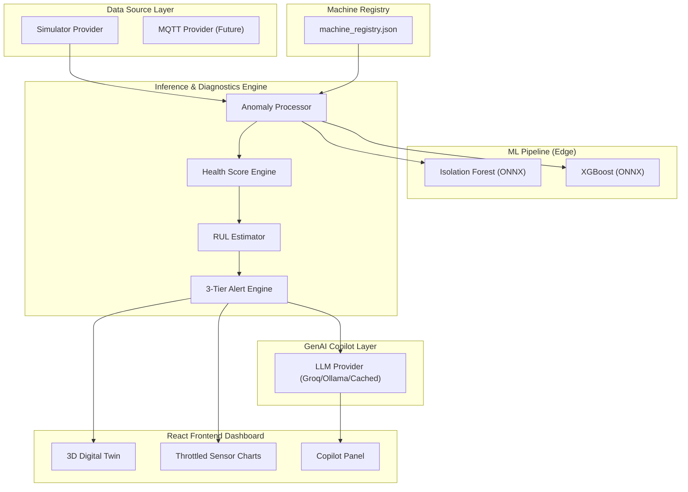

# 🏭 EdgeTwin Copilot

> **Predictive Maintenance & Digital Twin Platform**  
> *Developed for the InnoVent 2026 Competition.*

EdgeTwin Copilot is a lightweight, edge-first digital twin and predictive maintenance (PdM) dashboard. It integrates real-time machinery telemetry, local ONNX-based machine learning inference, and generative AI copilots to deliver low-latency diagnostics and immersive 3D physical visualizations directly to plant operators.

---

## 🚀 Key Features

* **Interactive 3D Digital Twin Viewer**: A high-fidelity, WebGL-powered 3D visualization using Three.js. Includes dynamic elements tied to live telemetry (spindle rotation, status stack lights, dynamic gauges, and gravity-based spark particle systems).
* **Edge Inference Engine**: Local anomaly detection (Isolation Forest) and multi-state classification (XGBoost) running in real-time on ONNX runtimes.
* **Explainable Health Scoring**: Transparent, sensor-weighted health status mapping so operators know exactly which sensors are decaying.
* **Escalating 3-Tier Alert System**: Avoids alert fatigue via cooldown periods, deduplication, and persistence verification. Includes interactive operator alert acknowledgment.
* **GenAI Maintenance Copilot**: Natural language root-cause analysis, risk assessment, and repair action guides with multi-provider fallbacks (Groq LLaMA, local Ollama, or cached offline modes).

---

## 📐 System Architecture



---

## ⚡ Quick Start (Standard Local Setup)

Ensure you have Python 3.10+ and Node.js 18+ installed.

### 1. Backend Setup
1. Navigate to the backend directory:
   ```bash
   cd backend
   ```
2. Create and activate a virtual environment:
   ```bash
   python3 -m venv .venv
   source .venv/bin/activate
   ```
3. Install dependencies:
   ```bash
   pip install -r requirements.txt
   ```
4. Set up your environment variables:
   ```bash
   cp .env.example .env
   # Add your GROQ_API_KEY to .env for the live copilot features
   ```
5. Run the backend server from the workspace root:
   ```bash
   cd ..
   PYTHONPATH=. backend/.venv/bin/python backend/main.py
   ```
   *The API will be available at `http://localhost:8000`.*

### 2. Frontend Setup
1. Open a new terminal and navigate to the frontend directory:
   ```bash
   cd frontend
   ```
2. Install dependencies:
   ```bash
   npm install
   ```
3. Start the Vite development server:
   ```bash
   npm run dev
   ```
   *The UI will be available at `http://localhost:5173`.*

---

## 🐳 Running with Docker

You can spin up the entire stack with a single command using Docker Compose:

```bash
docker-compose up --build
```
* Access the frontend dashboard at `http://localhost:5173`.
* Access the backend API docs at `http://localhost:8000/docs`.

---

## 🎮 How to Demo the App

Once both the frontend and backend are running, open `http://localhost:5173` in your browser:

1. **Switch Between Assets**: Use the **Machine Selector** dropdown at the top-center to swap between the **Air Compressor** and the **CNC Milling Machine**.
2. **Force Anomalies**: Use the **Sim Control Panel** at the top right to force different machine states:
   * **Normal**: The machine behaves normally with healthy telemetry.
   * **Warning**: Sensors drift, the status light glows amber, and health degrades.
   * **Critical / Failure**: Stack lights flash red, spark particle systems emit failure colors, and warning alerts trigger.
3. **Query the Copilot**: Click the **"Ask Copilot"** button in the right-hand panel during an anomaly to get real-time, LLM-generated diagnostic reports, root-cause analyses, and recommended maintenance guides.
4. **Change Simulation Speed**: Speed up or slow down telemetry intervals (0.5s, 1s, 2s, 5s) directly from the top navigation bar.
