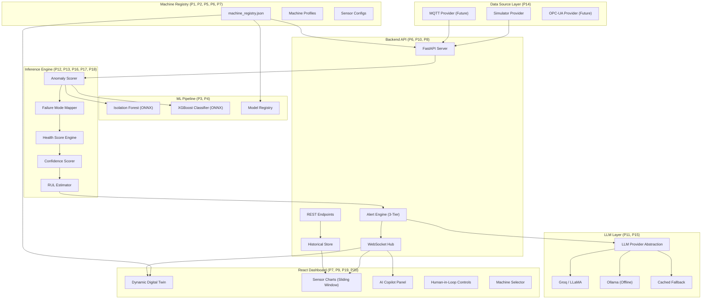
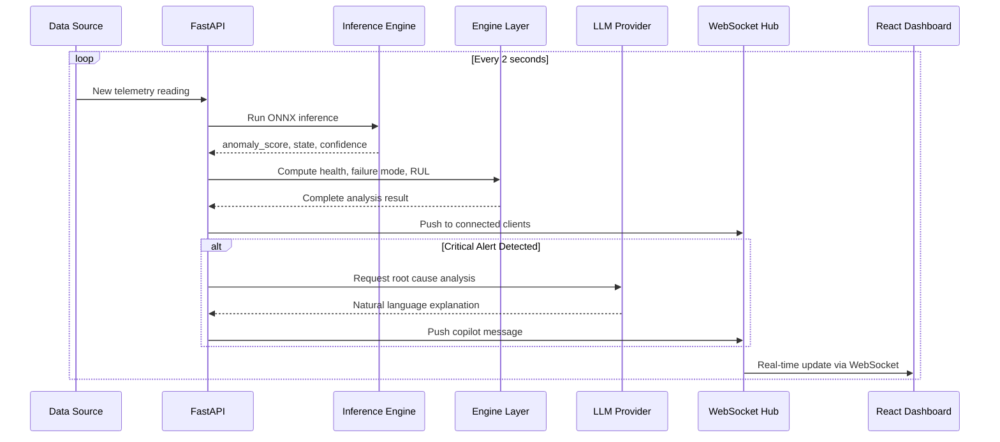
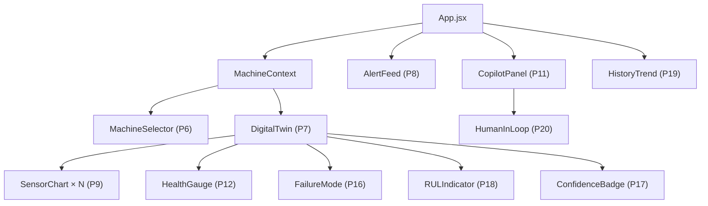

# EdgeTwin Copilot — Stage-Wise Architecture Design

> Every design decision in this document maps to a specific problem (P1–P27) it prevents.
> Build in order. Skip nothing. Each stage unlocks the next.

---

## Master Architecture Diagram



---

## Directory Structure

```
EdgeTwin Copilot/
├── backend/
│   ├── config/                          # ← P1, P2, P5, P6, P7
│   │   ├── machine_registry.json        #    Master machine definitions
│   │   └── failure_modes.json           #    Sensor-pattern → failure mapping
│   │
│   ├── data_sources/                    # ← P14
│   │   ├── base.py                      #    Abstract DataSource interface
│   │   ├── simulator.py                 #    Representative telemetry generator
│   │   └── mqtt.py                      #    Future: MQTT connector (stub)
│   │
│   ├── ml/                              # ← P3, P4
│   │   ├── train.py                     #    Training script (standalone)
│   │   ├── inference.py                 #    ONNX inference engine
│   │   └── model_registry.py            #    Model loader by machine_type
│   │
│   ├── engine/                          # ← P8, P12, P13, P16, P17, P18
│   │   ├── anomaly.py                   #    Anomaly scoring pipeline
│   │   ├── health_score.py              #    Transparent health formula
│   │   ├── failure_mapper.py            #    Pattern → failure mode
│   │   ├── confidence.py                #    Confidence % from XGBoost proba
│   │   └── rul.py                       #    Remaining Useful Life estimator
│   │
│   ├── llm/                             # ← P11, P15
│   │   ├── base.py                      #    Abstract LLM provider interface
│   │   ├── groq_provider.py             #    Groq API implementation
│   │   ├── ollama_provider.py           #    Local Ollama (offline fallback)
│   │   ├── cached_provider.py           #    Cached responses (offline)
│   │   └── prompt_templates.py          #    Structured prompt builder
│   │
│   ├── api/                             # ← P6, P10
│   │   ├── routes_machines.py           #    /machines/{id}/... endpoints
│   │   ├── routes_copilot.py            #    /copilot/explain endpoint
│   │   └── websocket_hub.py             #    WebSocket real-time push
│   │
│   ├── store/                           # ← P19
│   │   └── history.py                   #    In-memory + file historical store
│   │
│   ├── models/                          #    Trained ONNX model artifacts
│   │   ├── air_compressor/
│   │   │   ├── isolation_forest.onnx
│   │   │   └── xgboost_classifier.onnx
│   │   └── cnc_machine/                 #    Future machine type
│   │
│   ├── main.py                          #    FastAPI app entrypoint
│   └── requirements.txt
│
├── frontend/
│   ├── src/
│   │   ├── hooks/
│   │   │   └── useWebSocket.js          # ← P10: Real-time data hook
│   │   ├── context/
│   │   │   └── MachineContext.jsx        # ← P6: Multi-machine state
│   │   ├── components/
│   │   │   ├── MachineSelector.jsx       # ← P6: Machine picker
│   │   │   ├── DigitalTwin.jsx           # ← P7: Dynamic twin (config-driven)
│   │   │   ├── SensorChart.jsx           # ← P9: Sliding window chart
│   │   │   ├── HealthGauge.jsx           # ← P12: Explainable health score
│   │   │   ├── AlertFeed.jsx             # ← P8: 3-tier alert display
│   │   │   ├── FailureMode.jsx           # ← P16: Failure mode card
│   │   │   ├── RULIndicator.jsx          # ← P18: Remaining useful life
│   │   │   ├── ConfidenceBadge.jsx        # ← P17: Confidence %
│   │   │   ├── CopilotPanel.jsx          # ← P11: Structured LLM panel
│   │   │   ├── HumanInLoop.jsx           # ← P20: Acknowledge/Override
│   │   │   └── HistoryTrend.jsx          # ← P19: Historical trend graphs
│   │   ├── App.jsx
│   │   └── main.jsx
│   └── package.json
│
└── docs/
    ├── EdgeTwin_Problem_Registry.docx
    └── generate_problem_registry.js
```

---

## Stage 1 — Foundation Layer (Day 1–2)

> **Prevents: P1, P2, P5, P6, P7, P14**
> Build the configuration backbone. Every future component reads from this. Get this wrong and everything downstream breaks.

### 1A. Machine Registry (`config/machine_registry.json`)

This single JSON file defines **every machine, its sensors, thresholds, and model bindings**. No component should ever hardcode machine-specific logic.

```json
{
  "machines": [
    {
      "machine_id": "AC-001",
      "machine_type": "air_compressor",
      "display_name": "Air Compressor Unit 1",
      "location": "Plant Floor - Section A",
      "sensors": [
        {
          "sensor_id": "temp_01",
          "type": "temperature",
          "unit": "°C",
          "normal_range": [55, 75],
          "warning_threshold": 78,
          "critical_threshold": 92,
          "weight_in_health": 0.25
        },
        {
          "sensor_id": "vib_01",
          "type": "vibration",
          "unit": "mm/s",
          "normal_range": [1.5, 3.5],
          "warning_threshold": 4.2,
          "critical_threshold": 6.8,
          "weight_in_health": 0.30
        },
        {
          "sensor_id": "pres_01",
          "type": "pressure",
          "unit": "kPa",
          "normal_range": [95, 107],
          "warning_threshold": 108,
          "critical_threshold": 118,
          "weight_in_health": 0.20
        },
        {
          "sensor_id": "rpm_01",
          "type": "rpm",
          "unit": "RPM",
          "normal_range": [1700, 1900],
          "warning_threshold": 1650,
          "critical_threshold": 1500,
          "weight_in_health": 0.15
        },
        {
          "sensor_id": "pwr_01",
          "type": "power",
          "unit": "kW",
          "normal_range": [13, 17],
          "warning_threshold": 18,
          "critical_threshold": 21,
          "weight_in_health": 0.10
        }
      ],
      "model_path": "models/air_compressor",
      "failure_modes": ["bearing_wear", "overheating", "pressure_leakage", "lubrication_failure"]
    }
  ]
}
```

> **Why this matters:**
> - **P1 solved**: Adding a CNC machine = adding a new JSON object. Zero code change.
> - **P2 solved**: Adding a torque sensor to CNC = adding one sensor entry. Zero code change.
> - **P5 solved**: Generic sensor schema — no fixed columns.
> - **P6 solved**: `machine_id` is the primary key for everything.
> - **P7 solved**: Frontend reads this config to dynamically render the Digital Twin.

---

### 1B. Failure Mode Definitions (`config/failure_modes.json`)

Maps sensor deviation patterns to named industrial failure modes. This is the **knowledge layer** that makes anomaly detection explainable.

```json
{
  "air_compressor": [
    {
      "failure_mode": "bearing_wear",
      "display_name": "Bearing Degradation",
      "severity": "high",
      "description": "Progressive bearing surface deterioration causing increased friction and heat generation",
      "sensor_patterns": {
        "vibration": "elevated",
        "temperature": "rising",
        "rpm": "declining"
      },
      "recommended_action": "Inspect bearing assembly. Schedule replacement within 48-72 hours if vibration exceeds 6.0 mm/s.",
      "estimated_repair_hours": 4,
      "risk_if_ignored": "Catastrophic bearing seizure, shaft damage, unplanned shutdown"
    },
    {
      "failure_mode": "overheating",
      "display_name": "Thermal Anomaly",
      "severity": "critical",
      "sensor_patterns": {
        "temperature": "elevated",
        "power": "elevated",
        "vibration": "normal"
      },
      "recommended_action": "Check coolant levels, inspect ventilation, verify ambient conditions. Reduce load if temperature exceeds 90°C.",
      "estimated_repair_hours": 2,
      "risk_if_ignored": "Thermal shutdown, insulation damage, fire hazard"
    },
    {
      "failure_mode": "pressure_leakage",
      "display_name": "Pressure System Leak",
      "severity": "medium",
      "sensor_patterns": {
        "pressure": "declining",
        "temperature": "normal",
        "power": "elevated"
      },
      "recommended_action": "Inspect pneumatic lines, fittings, and valve seals. Perform pressure hold test.",
      "estimated_repair_hours": 3,
      "risk_if_ignored": "Reduced output capacity, compressor cycling, energy waste"
    },
    {
      "failure_mode": "lubrication_failure",
      "display_name": "Lubrication Deficiency",
      "severity": "high",
      "sensor_patterns": {
        "vibration": "elevated",
        "temperature": "rising",
        "power": "elevated"
      },
      "recommended_action": "Check oil levels and quality. Inspect lubrication lines. Schedule oil change and filter replacement.",
      "estimated_repair_hours": 2,
      "risk_if_ignored": "Accelerated bearing wear, overheating, premature component failure"
    }
  ]
}
```

> **P13 solved**: Every anomaly has a named failure mode with explanation.
> **P16 solved**: Pattern matching rules, not black-box ML guesswork.

---

### 1C. Data Source Abstraction (`data_sources/base.py`)

```python
# Abstract interface — all data sources implement this
from abc import ABC, abstractmethod
from typing import Dict, List

class DataSource(ABC):
    """
    Abstract data source interface.
    Simulator, MQTT, OPC-UA all implement this same contract.
    Downstream code never knows which source is active.
    """

    @abstractmethod
    async def get_reading(self, machine_id: str) -> Dict:
        """
        Returns a single telemetry reading:
        {
            "machine_id": "AC-001",
            "machine_type": "air_compressor",
            "timestamp": "2026-06-14T10:30:00Z",
            "sensors": {
                "temp_01": {"value": 67.3, "type": "temperature", "unit": "°C"},
                "vib_01":  {"value": 2.8,  "type": "vibration",   "unit": "mm/s"},
                ...
            }
        }
        """
        pass

    @abstractmethod
    async def start(self):
        """Initialize the data source connection."""
        pass

    @abstractmethod
    async def stop(self):
        """Clean shutdown."""
        pass
```

> **P14 solved**: Swap `SimulatorSource` for `MQTTSource` with one config change. Zero downstream code change.

---

### 1D. Generic Telemetry Schema

Every telemetry record in the system follows this universal schema:

```python
# Used everywhere — API responses, WebSocket messages, storage, inference input
TelemetryReading = {
    "machine_id": str,          # "AC-001"
    "machine_type": str,        # "air_compressor"
    "timestamp": str,           # ISO 8601
    "sensors": {
        "<sensor_id>": {
            "value": float,
            "type": str,        # "temperature", "vibration", etc.
            "unit": str         # "°C", "mm/s", etc.
        }
    }
}
```

> **P2 & P5 solved**: Any sensor, any machine, same schema. No migrations ever.

---

## Stage 2 — ML Pipeline (Day 3–5)

> **Prevents: P3, P4, P17**
> Training is a standalone offline process. Inference is a separate runtime process. Models are frozen ONNX artifacts. They never share a process.

### 2A. Training Pipeline (`ml/train.py`) — Standalone Script

```
┌──────────────────────────────────────────────────────────────┐
│                    TRAINING PIPELINE                         │
│                  (runs offline, NOT at runtime)              │
│                                                              │
│  machine_registry.json                                       │
│         │                                                    │
│         ▼                                                    │
│  Generate training data per machine_type                     │
│         │                                                    │
│         ├──► Isolation Forest ──► isolation_forest.onnx       │
│         │                                                    │
│         └──► XGBoost Classifier ──► xgboost_classifier.onnx  │
│                                                              │
│  Output: backend/models/{machine_type}/*.onnx                │
└──────────────────────────────────────────────────────────────┘
```

**Key design rules:**
- Reads machine config to know which sensors to generate data for
- Trains **separate models per machine_type** (P3)
- Exports to ONNX — frozen binary artifact (P4)
- XGBoost `.predict_proba()` gives confidence % (P17)
- **Never imported by main.py** — completely decoupled

### 2B. Model Registry (`ml/model_registry.py`)

```python
class ModelRegistry:
    """
    Loads the correct ONNX model for a given machine_type.
    Models are loaded lazily and cached in memory.
    """
    def __init__(self, models_dir: str):
        self._models_dir = models_dir
        self._cache = {}  # machine_type -> {iso_forest: session, xgboost: session}

    def get_models(self, machine_type: str):
        if machine_type not in self._cache:
            model_path = os.path.join(self._models_dir, machine_type)
            self._cache[machine_type] = {
                "isolation_forest": ort.InferenceSession(f"{model_path}/isolation_forest.onnx"),
                "xgboost": ort.InferenceSession(f"{model_path}/xgboost_classifier.onnx")
            }
        return self._cache[machine_type]
```

> **P3 solved**: Each machine type gets its own model. Add a new machine = train a new model, drop ONNX files into the folder.
> **P4 solved**: Training and inference are completely separate processes. Model update = replace `.onnx` file, restart server.

### 2C. Inference Engine (`ml/inference.py`)

```python
class InferenceEngine:
    """
    Runs ONNX inference for any machine type.
    Returns: anomaly_score, state_prediction, state_probabilities
    """
    def __init__(self, model_registry: ModelRegistry):
        self.registry = model_registry

    def predict(self, machine_type: str, sensor_values: np.ndarray) -> dict:
        models = self.registry.get_models(machine_type)

        # Isolation Forest → anomaly score
        iso_result = models["isolation_forest"].run(None, {"float_input": sensor_values})
        anomaly_score = iso_result[1]  # decision_function score

        # XGBoost → state classification + probabilities
        xgb_result = models["xgboost"].run(None, {"float_input": sensor_values})
        predicted_state = xgb_result[0]
        probabilities = xgb_result[1]  # ← P17: confidence scores

        return {
            "anomaly_score": float(anomaly_score),
            "predicted_state": int(predicted_state),
            "state_probabilities": probabilities.tolist(),
            "confidence": float(max(probabilities)) * 100  # ← P17
        }
```

---

## Stage 3 — Engine Layer (Day 6–8)

> **Prevents: P8, P12, P13, P16, P17, P18**
> This is the intelligence layer between raw ML output and what users see. Every score has a formula. Every anomaly has a name.

### 3A. Health Score Engine (`engine/health_score.py`)

```
Health Score Formula (P12 — fully explainable):

  health = Σ (sensor_weight × sensor_health)

  where sensor_health = 1.0  if value in normal_range
                      = linear decay from 1.0→0.0 between warning→critical
                      = 0.0  if value beyond critical

  Final: health = max(0, min(100, weighted_sum × 100))
```

Every digit is traceable to a sensor reading and a weight defined in `machine_registry.json`.

> **P12 solved**: "Health is 72% because vibration contributes 30% weight and is at 87% health (4.1 mm/s, warning threshold is 4.2), temperature contributes 25% weight at 65% health (82°C, critical at 92°C)..."

### 3B. Failure Mode Mapper (`engine/failure_mapper.py`)

```
Input: sensor deviations (which sensors are elevated/declining/normal)
Logic: Match against failure_modes.json patterns
Output: ranked list of probable failure modes with match confidence

Example flow:
  vibration=elevated, temperature=rising, rpm=declining
    → matches "bearing_wear" pattern (3/3 sensors match = 100%)
    → matches "lubrication_failure" pattern (2/3 sensors match = 67%)
    → returns: [
        {"mode": "bearing_wear", "match": 100%, "severity": "high"},
        {"mode": "lubrication_failure", "match": 67%, "severity": "high"}
      ]
```

> **P16 solved**: Named failure modes, not just "anomaly detected".
> **P13 solved**: Tells you exactly WHICH sensors triggered WHICH failure mode.

### 3C. RUL Estimator (`engine/rul.py`)

```
Remaining Useful Life estimation (P18):

  Method: Linear degradation extrapolation from health trend

  1. Store last N health scores (from historical store)
  2. Fit linear regression on health_score vs time
  3. Extrapolate: at what time does health_score = 0?
  4. RUL = projected_zero_time - current_time

  Fallback (insufficient history):
    Use state-based lookup table:
      Normal   → RUL: 30+ days
      Warning  → RUL: 7-14 days
      Critical → RUL: 1-3 days
      Failure  → RUL: 0 days
```

> **P18 solved**: Even approximate RUL is 10x more valuable than "failure likely".

### 3D. Alert Engine (`engine/anomaly.py`)

```
Three-tier alert system (P8):

  Level 1 — INFORMATIONAL (blue)
    Triggered: sensor crosses warning_threshold once
    Action: Log only, no notification

  Level 2 — WARNING (amber)
    Triggered: sensor stays above warning_threshold for 3+ consecutive readings
    Action: Dashboard highlight, feed entry

  Level 3 — CRITICAL (red)
    Triggered: sensor crosses critical_threshold OR health_score < 40
    Action: Dashboard alert, LLM Copilot auto-triggered, audible notification

  Rule: Alerts ESCALATE, never spam. A sensor must persist in anomaly
        across multiple readings before upgrading alert level.
```

> **P8 solved**: Conservative thresholds. No alert fatigue. Judges see a calm system that escalates only when real danger exists.

---

## Stage 4 — Backend API (Day 9–12)

> **Prevents: P6, P10, P11, P15, P19, P21**

### 4A. API Endpoint Design

```
REST Endpoints:
  GET  /api/machines                         → List all machines from registry
  GET  /api/machines/{id}                    → Machine profile + current state
  GET  /api/machines/{id}/health             → Current health score breakdown
  GET  /api/machines/{id}/history            → Last N readings + trends
  POST /api/machines/{id}/predict            → Run inference on latest reading
  POST /api/copilot/explain                  → LLM root cause analysis
  POST /api/machines/{id}/alerts/{alert_id}/acknowledge  → P20: Human-in-loop

WebSocket:
  WS   /ws/telemetry/{machine_id}            → Real-time sensor stream
  WS   /ws/alerts                            → Real-time alert feed
```

> **P6 solved**: Every endpoint is scoped to `machine_id`. Multi-machine from Day 1.
> **P10 solved**: WebSocket for real-time. No polling.

### 4B. WebSocket Architecture



### 4C. LLM Provider Abstraction (`llm/base.py`)

```python
class LLMProvider(ABC):
    """
    Abstract LLM interface. Switch providers with one config change.
    """
    @abstractmethod
    async def analyze(self, context: dict) -> str:
        """
        Input context (structured — P11):
        {
            "machine_type": "air_compressor",
            "machine_name": "Air Compressor Unit 1",
            "health_score": 42,
            "anomaly_score": 0.87,
            "sensor_readings": {...},
            "sensor_deviations": {"vibration": "+2.3 above warning", ...},
            "detected_failure_modes": ["bearing_wear"],
            "confidence": 87.3,
            "rul_estimate_days": 5
        }

        Output: Structured natural language analysis
        """
        pass
```

**Implementations:**

| Provider | File | When Used |
|---|---|---|
| Groq (LLaMA 3) | `groq_provider.py` | Primary — fast cloud inference |
| Ollama (Local) | `ollama_provider.py` | Offline / edge deployment (P21) |
| Cached Fallback | `cached_provider.py` | API failure graceful degradation |

> **P15 solved**: Switch Groq → OpenAI → Ollama with one environment variable.
> **P21 solved**: System works fully offline with ONNX inference + cached/local LLM.
> **P11 solved**: LLM receives structured context only. Cannot hallucinate about unrelated machines.

### 4D. Structured Prompt Template (`llm/prompt_templates.py`)

```python
MAINTENANCE_ANALYSIS_PROMPT = """
You are an industrial maintenance AI assistant analyzing machine telemetry data.

MACHINE: {machine_name} ({machine_type})
LOCATION: {location}

CURRENT READINGS:
{sensor_readings_formatted}

DEVIATIONS FROM NORMAL:
{sensor_deviations_formatted}

ANALYSIS RESULTS:
- Health Score: {health_score}/100
- Anomaly Score: {anomaly_score}
- Predicted State: {predicted_state}
- Confidence: {confidence}%
- Detected Failure Mode(s): {failure_modes}
- Estimated Remaining Useful Life: {rul_estimate}

Based on the above sensor data and analysis, provide:
1. ROOT CAUSE: What is likely causing this anomaly pattern
2. RISK ASSESSMENT: Severity and urgency (use the sensor evidence)
3. RECOMMENDED ACTION: Specific maintenance steps with timeline
4. CONSEQUENCE OF INACTION: What happens if this is ignored

Keep the response concise, specific to the sensor data provided, and
actionable for a maintenance engineer. Do not speculate beyond the
data provided.
"""
```

> **P11 solved**: LLM is constrained to the data it receives. Every claim must tie back to sensor evidence.

### 4E. Historical Store (`store/history.py`)

```python
class HistoricalStore:
    """
    Stores last N readings per machine for trend analysis (P19).
    In-memory with periodic JSON dump for persistence.
    """
    def __init__(self, max_readings_per_machine=500):
        self._store = {}  # machine_id -> deque(maxlen=max_readings)
        self._max = max_readings_per_machine

    def append(self, machine_id: str, reading: dict):
        if machine_id not in self._store:
            self._store[machine_id] = deque(maxlen=self._max)
        self._store[machine_id].append(reading)

    def get_history(self, machine_id: str, last_n: int = 100) -> list:
        return list(self._store.get(machine_id, []))[-last_n:]

    def get_health_trend(self, machine_id: str, last_n: int = 50) -> list:
        """Returns [{timestamp, health_score}, ...] for trend chart."""
        ...
```

> **P19 solved**: Historical trends stored server-side. Frontend requests what it needs.

---

## Stage 5 — React Dashboard (Day 13–17)

> **Prevents: P7, P8, P9, P19, P20**

### 5A. Component Architecture



### 5B. Key Frontend Patterns

**Sliding Window (P9):**
```javascript
// useWebSocket.js — ALWAYS trim to prevent memory bloat
const handleMessage = (event) => {
  const data = JSON.parse(event.data);
  setSensorData(prev => {
    const updated = [...prev, data];
    return updated.slice(-MAX_DATA_POINTS); // MAX = 100
  });
};
```

**Dynamic Digital Twin (P7):**
```javascript
// DigitalTwin.jsx — renders from machine config, not hardcoded
const DigitalTwin = ({ machineConfig }) => {
  return (
    <div className="digital-twin">
      <h2>{machineConfig.display_name}</h2>
      {machineConfig.sensors.map(sensor => (
        <SensorChart
          key={sensor.sensor_id}
          sensorConfig={sensor}     // unit, thresholds from config
          data={sensorData[sensor.sensor_id]}
        />
      ))}
    </div>
  );
};
// Adding a new machine type = loading its config JSON. Zero component changes.
```

**Human-in-Loop (P20):**
```javascript
// HumanInLoop.jsx — AI recommends, human decides
<AlertCard alert={alert}>
  <CopilotRecommendation text={alert.llm_analysis} />
  <div className="actions">
    <button onClick={() => acknowledge(alert.id)}>
      ✅ Acknowledge & Schedule Maintenance
    </button>
    <button onClick={() => override(alert.id)}>
      ⚠️ Override — False Alarm
    </button>
    <button onClick={() => escalate(alert.id)}>
      🔴 Escalate to Supervisor
    </button>
  </div>
</AlertCard>
```

> **P20 solved**: AI recommendation → Engineer review → Action. The workflow exists even in the PoC.

### 5C. Dashboard Layout

```
┌─────────────────────────────────────────────────────────────────┐
│  EdgeTwin Copilot          [Machine Selector ▼]     [⚡ Live]  │
├──────────────────────────────────────────┬──────────────────────┤
│                                          │                      │
│   ┌─ Health Score ──────────────────┐    │   AI Copilot Panel   │
│   │        72%  ▼ Warning           │    │                      │
│   │  [████████████░░░░░░]           │    │  "Elevated vibration │
│   │  Confidence: 87%  RUL: 5 days   │    │   levels accompanied │
│   └─────────────────────────────────┘    │   by sustained temp   │
│                                          │   increase. Pattern   │
│   ┌─ Sensor Charts (Real-time) ─────┐   │   consistent with    │
│   │  Temperature  [───────/──────]  │   │   bearing wear..."   │
│   │  Vibration    [────────/─────]  │   │                      │
│   │  Pressure     [──────────────]  │   │  Failure Mode:       │
│   │  RPM          [──────────────]  │   │  🔴 Bearing Wear     │
│   │  Power        [──────────────]  │   │     (87% confidence) │
│   └─────────────────────────────────┘   │                      │
│                                          │  ┌────────────────┐  │
│   ┌─ Alert Feed ────────────────────┐   │  │ ✅ Acknowledge  │  │
│   │ 🔴 14:23 Critical vibration     │   │  │ ⚠️ Override     │  │
│   │ 🟡 14:20 Warning temperature    │   │  │ 🔴 Escalate     │  │
│   │ 🔵 14:18 Info: pressure spike   │   │  └────────────────┘  │
│   └─────────────────────────────────┘   │                      │
│                                          │                      │
│   ┌─ Health Trend (Historical) ─────┐   │                      │
│   │  [chart: health over last 24h]  │   │                      │
│   └─────────────────────────────────┘   │                      │
├──────────────────────────────────────────┴──────────────────────┤
│  Maintenance History  |  System Status: Edge Mode ✅  |  v1.0  │
└─────────────────────────────────────────────────────────────────┘
```

---

## Stage 6 — Polish & Edge Readiness (Day 18–21)

> **Prevents: P21, and preparation for P22–P27**

### 6A. Offline Capability (P21)

| Component | Online Mode | Offline Mode |
|---|---|---|
| Telemetry | Simulator (local) | Simulator (local) — no change |
| Inference | ONNX Runtime (local) | ONNX Runtime (local) — no change |
| Health/Alerts | Engine Layer (local) | Engine Layer (local) — no change |
| LLM Copilot | Groq API (cloud) | Cached responses + Ollama (local) |
| Dashboard | React (local) | React (local) — no change |

> The only cloud dependency is the LLM layer, and it has a fallback. **Everything else runs locally from Day 1.**

### 6B. Docker Containerization

```dockerfile
# Dockerfile — Edge deployment ready
FROM python:3.11-slim
WORKDIR /app
COPY backend/ ./backend/
COPY backend/requirements.txt .
RUN pip install --no-cache-dir -r requirements.txt
EXPOSE 8000
CMD ["uvicorn", "backend.main:app", "--host", "0.0.0.0", "--port", "8000"]
```

```yaml
# docker-compose.yml — Full stack
version: "3.8"
services:
  backend:
    build: .
    ports: ["8000:8000"]
    environment:
      - LLM_PROVIDER=groq        # or "ollama" or "cached"
      - GROQ_API_KEY=${GROQ_API_KEY}
      - DATA_SOURCE=simulator     # or "mqtt"

  frontend:
    build: ./frontend
    ports: ["3000:3000"]
    depends_on: [backend]
```

---

## Problem Coverage Matrix

Every problem from the registry, mapped to the architectural decision that prevents it:

| Problem | Stage | Solution |
|---|---|---|
| **P1** Hardcoded Machine Logic | 1A | Machine Registry JSON |
| **P2** Sensor Explosion | 1A, 1D | Generic sensor schema |
| **P3** One Model Per Machine Type | 2B | Model Registry per machine_type |
| **P4** Training-Inference Coupling | 2A, 2C | Separate processes, ONNX artifacts |
| **P5** Poor Database Design | 1D | Generic telemetry schema |
| **P6** No Multi-Machine Support | 1A, 4A | machine_id in every record, scoped APIs |
| **P7** Static Digital Twin | 1A, 5B | Config-driven component rendering |
| **P8** False Alarm Fatigue | 3D | Three-tier escalating alert system |
| **P9** React Memory Bloat | 5B | Sliding window `.slice(-100)` |
| **P10** WebSocket vs Polling | 4B | WebSocket from Day 1 |
| **P11** LLM Hallucinations | 4C, 4D | Structured context-only prompts |
| **P12** Unreliable Health Score | 3A | Transparent weighted formula |
| **P13** Explainability Gap | 1B, 3B | Failure modes + per-sensor contribution |
| **P14** Simulator Dependency | 1C | Data Source abstraction layer |
| **P15** Vendor Lock-In (LLM) | 4C | LLM Provider abstraction |
| **P16** Failure Mode Identification | 1B, 3B | Pattern → failure mode mapping |
| **P17** Confidence Scoring | 2C | XGBoost `.predict_proba()` |
| **P18** Remaining Useful Life | 3C | Linear degradation extrapolation |
| **P19** Historical Trend Analysis | 4E, 5C | Historical store + trend chart |
| **P20** Human-in-the-Loop | 5B | Acknowledge / Override / Escalate |
| **P21** Edge Connectivity Loss | 4C, 6A | ONNX local + LLM fallback |
| **P22** Scalability | 6B | Docker + extensible registry (roadmap) |
| **P23** Model Drift | — | Future: retraining pipeline |
| **P24** Data Quality | — | Future: preprocessing pipeline |
| **P25** Maintenance Workflow | — | Future: CMMS integration |
| **P26** Industrial Integration | — | Future: webhook layer |
| **P27** Security | — | Future: JWT + RBAC |

---

## Build Order Summary

| Stage | Days | What You Build | Problems Killed |
|---|---|---|---|
| **1. Foundation** | 1–2 | Machine Registry, Sensor Schema, Data Source Abstraction, Failure Mode Config | P1, P2, P5, P6, P7, P14 |
| **2. ML Pipeline** | 3–5 | Train script, Model Registry, ONNX export, Inference Engine | P3, P4, P17 |
| **3. Engine Layer** | 6–8 | Health Score, Failure Mapper, RUL, Alert Engine, Confidence | P8, P12, P13, P16, P18 |
| **4. Backend API** | 9–12 | FastAPI, WebSocket, LLM Abstraction, History Store | P6, P10, P11, P15, P19, P21 |
| **5. React Dashboard** | 13–17 | Digital Twin, Charts, Copilot Panel, HiL Controls | P7, P9, P19, P20 |
| **6. Polish** | 18–21 | Docker, Offline mode, Demo script, PPT, Video | P21, P22 prep |

> [!TIP]
> **If you build in this order, you will never encounter any of the 27 problems.** Each stage creates the abstractions that the next stage depends on. No rework. No rewrite. No surprises.
